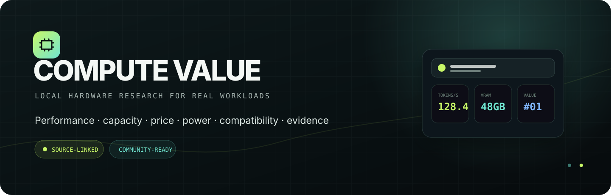
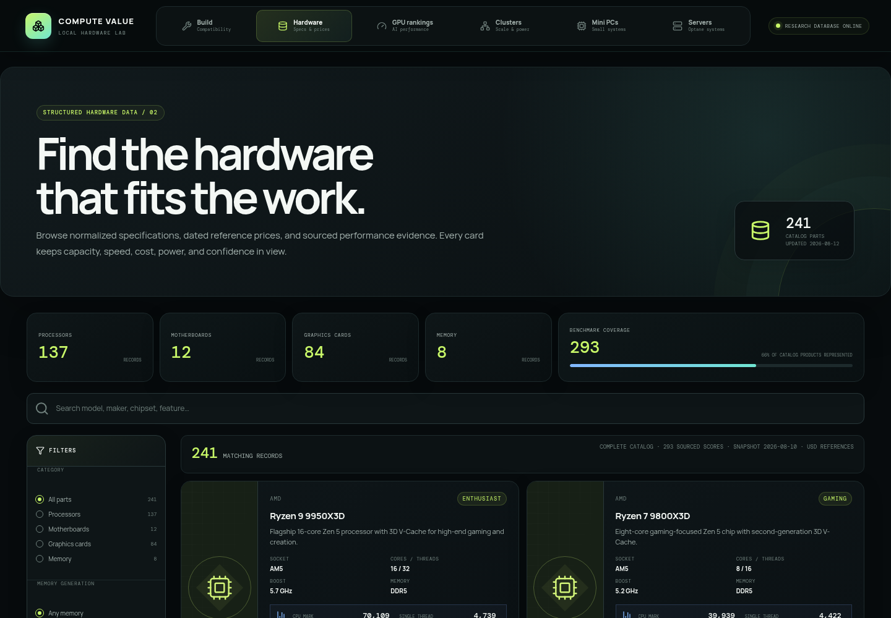

<div align="center">
  
</div>

<div align="center">
  <br />
  <strong>A personal hardware database, built in public for anyone who wants more useful compute per dollar.</strong>
  <br /><br />
  <a href="#why-local-compute">Why local?</a> ·
  <a href="#what-you-can-answer">Explore the data</a> ·
  <a href="#evidence-before-confidence">Evidence model</a> ·
  <a href="#run-it-locally">Run locally</a> ·
  <a href="#contributing">Contribute</a>
  <br /><br />
  
  
  
  
</div>

---

## Why local compute

The cloud is useful, but it should not be the only way to do serious work. A capable local machine gives you privacy, predictable costs, control over your tools, offline availability, and hardware that keeps producing value after the first month.

The difficult part is buying well. Product names hide memory limits. Peak specifications do not guarantee model speed. A cheap accelerator can become expensive after the host, cooling, power delivery, and interconnect are included. Two cards with the same VRAM can behave very differently once a real workload starts.

**Compute Value exists to make those tradeoffs visible.** It is a personal research database dedicated to helping anyone compare hardware by the things that actually matter: workload performance, usable memory, power, system cost, compatibility, and the quality of the evidence.

> The goal is not to crown one universally “best” GPU. The goal is to show which route makes sense for *your* model, budget, outlet, chassis, and tolerance for complexity.

## What you can answer

| Question | Where the app helps |
|---|---|
| What can I build without socket, memory, PCIe, cooling, PSU, or outlet conflicts? | Guided AI-homelab designer and advanced compatibility auditor |
| Will this exact model fit at my context and concurrency? | Weight, runtime, KV-cache, tensor-split, and offload calculator |
| Which GPUs are fastest on the same LLM protocol? | Fixed-control token-generation and prompt-processing rankings |
| What gives me the most useful AI performance for the purchase price? | 50/50 performance-and-value buyer score with a capped VRAM contribution |
| What fits a 24, 32, 40, 48, 72, 80, or 96 GB model target? | VRAM-focused GPU research and model-format compatibility |
| Can this system run from a normal household circuit? | Whole-system and four-GPU cluster power guidance |
| Where does scaling break down? | PCIe, NVLink/NVSwitch, tensor-parallel, and cluster topology notes |
| Is a number measured, proxied, or modeled? | Visible evidence tiers, source links, uncertainty, and missing-data states |
| What does the used market change? | Dated, seller-screened marketplace observations kept separate from MSRP |

## The database at a glance

<table>
  <tr>
    <td align="center"><strong>290</strong><br /><sub>seeded hardware records</sub></td>
    <td align="center"><strong>84</strong><br /><sub>researched NVIDIA & AMD GPUs</sub></td>
    <td align="center"><strong>34</strong><br /><sub>same-file Llama 2 7B GPU results</sub></td>
    <td align="center"><strong>68</strong><br /><sub>GPUs with 24 GB+ addressable VRAM</sub></td>
  </tr>
  <tr>
    <td align="center"><strong>15</strong><br /><sub>NVIDIA Blackwell variants</sub></td>
    <td align="center"><strong>13</strong><br /><sub>audited exact-48-GB cards</sub></td>
    <td align="center"><strong>12</strong><br /><sub>complete Optane server systems</sub></td>
    <td align="center"><strong>4-GPU</strong><br /><sub>cluster compatibility matrix</sub></td>
  </tr>
</table>

<div align="center">
  
  <sub>The same research database at desktop and mobile widths, with confidence and source context kept beside the numbers.</sub>
</div>

<br />

The catalog spans CPUs, motherboards, memory, consumer GPUs, workstation accelerators, data-center cards, PSUs, chassis, cooling, storage, networking, 128 GB+ Apple systems, mini AI PCs, and complete server systems. GPU research covers NVIDIA and AMD separately, then organizes NVIDIA cards by architecture—from Volta and Turing through Ampere, Ada, Hopper, and Blackwell.

### The AI homelab designer

The builder now starts with the workload and exact model profile, then audits a complete node:

- Quantity-aware 1–8 GPU configurations and per-slot PCIe topology.
- CPU socket, memory generation/registration/capacity, cooling, and physical chassis fit.
- ATX 3.x PSU capacity, native high-power GPU connectors, and cable counts.
- US 120/240 V and international 230 V household-power planning profiles.
- Wall power, amperage, circuit utilization, heat output, and modeled power-limit retention.
- Model weights, runtime reserve, KV cache, context, concurrency, tensor splitting, and CPU offload.
- Complete hardware cost with already-owned parts excluded.
- Shareable builds, JSON export, simple guidance, and an advanced evidence view.

Read the **[AI Homelab Field Guide](docs/AI-HOMELAB-GUIDE.md)** or the **[Benchmark Contribution Contract](docs/BENCHMARK-CONTRIBUTION.md)**.

### Workload research included

- Same-file `llama.cpp` Llama 2 7B Q4_0 comparisons with `tg128` and `pp512` kept separate.
- A second Llama 3.1 8B control plus exact-file Q8 RTX 5090-versus-H200 NVL evidence.
- Qwen, LocalScore, UL Procyon, NVIDIA Cosmos, and MLPerf cross-checks that remain separate when protocols differ.
- NVIDIA Pro Blackwell, H100/H200, A100/A800, V100 PCIe/SXM, DGX Spark, and multi-GPU workstation research.
- Model-format compatibility across language, image, and video generation with Q4, Q8, FP16, BF16, runtime, sharding, and VRAM requirements stored independently.
- Memory-hard Argon2id and Tails-equivalent LUKS2 research with exact profiles and explicit measured/model boundaries.
- Whole-catalog hash-rate value views for lawful performance research; different algorithms are never blended into one synthetic rate.

## Evidence before confidence

Every polished number should still answer: **where did this come from?** Compute Value uses four visible evidence states:

| Evidence state | Meaning | Ranking treatment |
|---|---|---|
| **Measured** | The exact hardware and stated protocol were published or captured directly | Eligible for the matching fixed-control ranking |
| **Hardware-qualified** | The exact device is known, but part of the workload context is incomplete | Shown with a qualification warning |
| **Proxy** | Same silicon, sibling configuration, or a defensible published analogue | Kept separate from exact measurements |
| **Model / estimate** | Derived from bandwidth, scaling, or another explicit assumption | Labeled with uncertainty; never presented as measured |

This matters most for memory-hard workloads. More VRAM creates capacity for larger models or more concurrent jobs; it does **not** automatically make one Argon2 guess faster. Likewise, CUDA-core count, bandwidth, tensor throughput, and model speed are related but not interchangeable.

Price evidence has its own rules. Reference prices, direct-retailer inventory, and used-market asks are stored separately. Screened eBay observations require an exact model match, used condition, at least 98% positive feedback, and at least 100 seller-feedback records. Sold-out pages, parts-only cards, misleading lots, and whole-system listings do not enter value calculations.

Read the complete methodology and reproducibility contract in **[Scoring and Data](docs/SCORING-AND-DATA.md)**.

## Product principles

```
Useful capacity  +  real workload speed  +  complete system cost
───────────────────────────────────────────────────────────────
       power, topology, compatibility, and evidence quality
```

1. **Compare like with like.** Model, quantization, runtime, batch size, context, offload, and topology stay attached to every performance result.
2. **Show missing data.** An honest blank is more useful than a confident-looking invention.
3. **Keep capacity and speed separate.** VRAM determines what can fit; compute and memory behavior determine how quickly it runs.
4. **Price the route, not only the card.** Host platform, power delivery, cooling, interconnects, and chassis constraints can change the answer.
5. **Make every assumption inspectable.** Sources, dates, formulas, evidence tiers, and uncertainty belong next to the conclusion.

## Repository map

```text
compute-value/
├── server/                     typed source records, SQLite seeding, API
│   ├── catalog.ts              hardware and specification catalog
│   ├── benchmarks.ts           conventional benchmark evidence
│   ├── llm-benchmarks.ts       fixed-control LLM results
│   ├── ebay-market.ts          screened used-market observations
│   ├── homelab.ts              compatibility, model-fit and power engine
│   └── homelab-catalog.ts      validated supporting-product loader
├── data/
│   ├── catalog/                reviewable homelab product records
│   └── schemas/                contribution data contracts
├── src/
│   ├── components/             builder, rankings, research labs, explorers
│   ├── data/                   scores, protocols, clusters, model support
│   ├── lib/                    API and display helpers
│   └── styles/app.css          responsive Compute Value visual system
├── docs/
│   ├── SCORING-AND-DATA.md     formulas, evidence rules, reproducibility
│   ├── AI-HOMELAB-GUIDE.md     model-to-system planning guide
│   └── BENCHMARK-CONTRIBUTION.md reproducible submission contract
├── scripts/                    repeatable research helpers
└── data/pc-builder.sqlite      generated local database; never published
```

## Run it locally

### Requirements

- Node.js 20 or newer
- npm

```bash
git clone https://github.com/Fahrnetic/compute-value.git
cd compute-value
npm install
npm run dev
```

Open **http://localhost:5173**. Vite serves the React interface and proxies API requests to the Express service on port `4174`.

For the production build:

```bash
npm run build
npm start
```

Open **http://localhost:4174**.

### Verification

```bash
npm test
npm run validate:data
npm run build
curl http://localhost:4174/api/health
```

The SQLite database is generated at `data/pc-builder.sqlite`. Set `PC_BUILDER_DB_PATH` to use a different local location.

## API

| Method | Endpoint | Purpose |
|---|---|---|
| `GET` | `/api/catalog` | Complete catalog with optional category and search filters |
| `GET` | `/api/ai-model-compatibility` | Model, format, precision, cluster, and fit matrix |
| `GET` | `/api/hashcat-argon2` | Configuration-locked Argon2id evidence and models |
| `GET` | `/api/hashcat-luks2` | Fixed 1 GiB Tails-equivalent LUKS2 evidence |
| `GET` | `/api/compatible` | Compatible product IDs for the current build |
| `POST` | `/api/validate` | Full compatibility, power, total, and issue report |
| `GET` | `/api/v2/products` | Paginated, faceted v2 catalog including homelab parts and Apple systems |
| `POST` | `/api/v2/builds/validate` | Quantity-aware complete-node compatibility and cost audit |
| `POST` | `/api/v2/model-fit` | Model, context, concurrency, sharding, and offload fit report |
| `POST` | `/api/v2/power-plan` | PSU, wall circuit, amperage, heat, and power-limit plan |
| `GET` | `/api/v2/benchmark-profiles` | Frozen model controls and electrical planning profiles |

Examples:

```text
/api/catalog?category=gpu&search=blackwell
/api/ai-model-compatibility?modality=video&precision=Q4&cluster=rtx3090-quad
/api/compatible?cpu=amd-ryzen-7-9800x3d
```

## Contributing

This started as a personal database, but it is meant for anyone to inspect, use, improve, and contribute to. The most valuable contribution is not simply another number—it is a number with enough context that another person can reproduce or correctly qualify it.

### A strong data contribution includes

- Exact hardware identity, including capacity, form factor, cooling variant, and accelerator count.
- Workload/checkpoint, quantization or dtype, runtime and version, batch/concurrency, context length, and command line.
- Host CPU, system memory, operating system, driver, power limit, and relevant interconnect topology.
- Result units and whether the value is single-stream, aggregate throughput, prompt processing, generation, or latency.
- Primary source URL, observation date, and enough notes to distinguish measurement from inference.

### Before opening a change

1. Read [Scoring and Data](docs/SCORING-AND-DATA.md).
2. Keep unlike protocols in separate datasets and UI lanes.
3. Add or update tests for formulas, filtering, and evidence labels.
4. Run `npm test` and `npm run build`.
5. Explain what the new evidence changes—and what it still cannot prove.

Bug reports, missing-card requests, source corrections, UI improvements, and reproducible benchmark submissions are all welcome.

## Scope and responsible use

Prices are dated research references, not live offers or purchasing advice. Compatibility rules reduce obvious mistakes but cannot replace board QVLs, mechanical measurements, electrical planning, or manufacturer documentation.

Security-workload data in this project exists only to compare lawful hardware-compute characteristics and memory-hard behavior. Use it only on systems and data you own or are explicitly authorized to test.

---

<div align="center">
  <strong>Better local compute decisions should not require a sales call.</strong>
  <br />
  <sub>Measure carefully · label uncertainty · share what you learn</sub>
</div>
